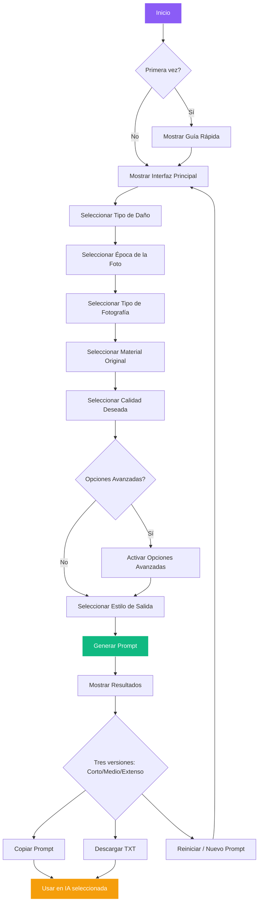

# 📸 ResFotoPrompts


---

## 🌐 Web en vivo

<div align="center">
  <a href="https://jhormancastella.github.io/ResFotoPrompts/" target="_blank">
    
  </a>
</div>

---

## 📖 Descripción

**ResFotoPrompts** es una herramienta web interactiva diseñada para generar **prompts profesionales** para restauración de fotos antiguas mediante inteligencia artificial. Permite construir prompts detallados seleccionando opciones organizadas por categorías: tipo de daño, época de la foto, tipo de fotografía, material original y calidad deseada. Además, adapta el resultado a diferentes plataformas de IA de restauración como Flux, Midjourney, GFPGAN, Topaz Photo AI y más.

---

## ✨ Características principales

- **Generador de Prompts por Secciones** – Construye prompts paso a paso de manera intuitiva.
- **Múltiples Versiones** – Genera versiones corta, media y extensa del prompt según la IA a utilizar.
- **Modo Básico y Avanzado** – Elige entre opciones limitadas o el catálogo completo de características.
- **Idioma bilingüe** – Alterna entre español e inglés con un clic.
- **Modo oscuro/claro** – Interfaz adaptable a preferencias visuales con persistencia.
- **Copiado inteligente** – Copia el prompt listo para usar en la IA seleccionada.
- **Diseño Responsivo** – Funciona en dispositivos móviles y de escritorio.
- **PWA Instalable** – Añade la aplicación a tu dispositivo móvil.

---

## 🧭 Flujo de uso (interactivo)



---

## 🛠️ Tecnologías utilizadas

- **HTML5** – Estructura semántica y accesibles.
- **CSS3** – Estilos modernos, modo oscuro/claro, diseño responsivo con variables personalizadas.
- **JavaScript ES6+** – Lógica de generación, manejo de datos y eventos (módulos).
- **LocalStorage** – Persistencia de preferencias y tema.
- **PWA (Progressive Web App)** – Instalable como aplicación nativa.

---

## 📂 Estructura del proyecto

```
ResFotoPrompts/
├── index.html              # Página principal
├── manifest.json           # Configuración PWA
├── package.json            # Scripts de build
├── .gitignore             # Archivos ignorados
├── robots.txt             # Configuración para buscadores
├── sitemap.xml            # Mapa del sitio
├── css/                   # Módulos CSS
│   ├── main.css
│   ├── header.css
│   ├── layout.css
│   ├── options.css
│   ├── advanced.css
│   ├── buttons.css
│   ├── output.css
│   ├── ai-cards.css
│   ├── modal.css
│   ├── footer.css
│   ├── background.css
│   └── responsive.css
├── js/
│   ├── main.js            # Punto de entrada
│   ├── data/
│   │   └── appData.js     # Datos de la aplicación
│   └── modules/
│       ├── translations.js # Internacinalización (i18n)
│       ├── state.js       # Gestión de estado
│       ├── ui.js          # Renderizado de interfaz
│       ├── prompts.js     # Generación de prompts
│       └── security.js    # Seguridad y validación
└── img/
    └── logo.jpeg          # Logo y favicon
```

---

## 🚀 Uso local

Sigue estos pasos para ejecutar ResFotoPrompts en tu máquina:

1. Clona el repositorio
   ```bash
   git clone https://github.com/tu-usuario/ResFotoPrompts.git
   cd ResFotoPrompts
   ```

2. Abre el proyecto
   Simply abre el archivo `index.html` en tu navegador favorito.

3. Explora y genera prompts
   Selecciona las opciones deseadas, elige la versión y copia el resultado.

⚠️ **Nota**: No requiere servidor backend ni instalación de dependencias.

### Scripts de Desarrollo (opcional)

```bash
# Desarrollo
npm run dev

# Build (minificación)
npm run build
```

---

## 🔍 SEO y accesibilidad

- Metatags básicos en `index.html` para mejorar la visibilidad en buscadores.
- `robots.txt` y `sitemap.xml` configurados para motores de búsqueda.
- Estructura semántica HTML5 para accesibilidad.
- Contraste de colores y navegación por teclado considerados.
- Atributos ARIA donde es necesario.

---

## 🤝 Contribuciones

Las contribuciones son bienvenidas. Si deseas mejorar el proyecto:

1. Haz un fork del repositorio.
2. Crea una rama con tu nueva funcionalidad:
   ```bash
   git checkout -b feature/nueva-funcionalidad
   ```
3. Realiza tus cambios y haz commit:
   ```bash
   git commit -m 'Añade nueva funcionalidad'
   ```
4. Sube los cambios:
   ```bash
   git push origin feature/nueva-funcionalidad
   ```
5. Abre un Pull Request.

Por favor, asegúrate de que tu código sigue el estilo general y de que no introduce errores.

---

## 📄 Licencia

Este proyecto se distribuye bajo la licencia MIT. Consulta el archivo LICENSE para más detalles.

---

## 📬 Contacto

Si tienes preguntas o sugerencias, no dudes en abrir un issue en el repositorio o contactar al autor.

---

todos los derechos reservados.

© 2026 ResFotoPrompts – Hecho con ❤️ para preservar tus recuerdos.
